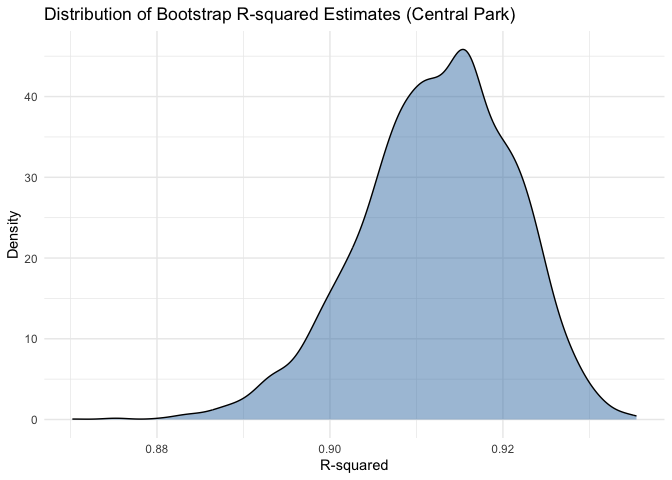
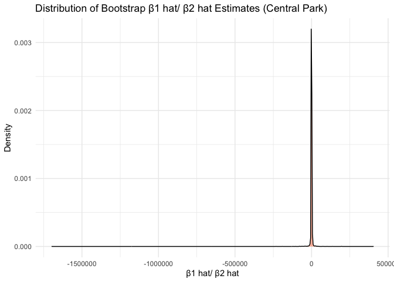
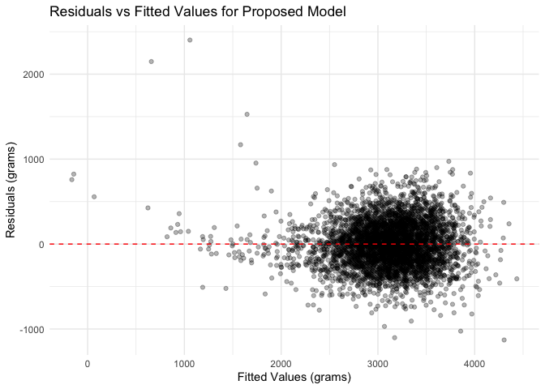
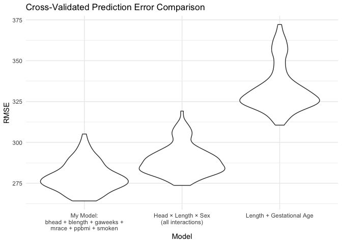

p8105_hw6_ao2965
================
Alissa Shams Orchi
2025-12-02

# Problem 2

## Generating 5000 bootstrap samples

``` r
boot_results = 
  central_park_df |> 
  modelr::bootstrap(n = 5000) |> 
  mutate(
    models = map(strap, \(df) lm(tmax ~ tmin + prcp, data = df)),
    glance_results = map(models, broom::glance),
    tidy_results = map(models, broom::tidy)
  )
```

## Extracting the two quantities

``` r
boot_results = 
  central_park_df |> 
  modelr::bootstrap(n = 5000) |> 
  mutate(
    models = map(strap, \(df) lm(tmax ~ tmin + prcp, data = df)),
    glance_results = map(models, broom::glance),
    tidy_results = map(models, broom::tidy)
  )

r_squared = 
  boot_results |> 
  select(.id, glance_results) |> 
  unnest(glance_results) |> 
  select(.id, r.squared)

beta_ratio = 
  boot_results |> 
  select(.id, tidy_results) |> 
  unnest(tidy_results) |> 
  select(.id, term, estimate) |> 
  pivot_wider(
    names_from = term,
    values_from = estimate
  ) |> 
  mutate(
    beta1_beta2 = tmin / prcp
  ) |> 
  select(.id, beta1_beta2)

bootstrap_estimates = 
  left_join(r_squared, beta_ratio, by = ".id")
```

``` r
bootstrap_estimates |> 
  ggplot(aes(x = r.squared)) +
  geom_density(fill = "steelblue", alpha = 0.5) +
  labs(
    title = "Distribution of Bootstrap R-squared Estimates (Central Park)",
    x = "R-squared",
    y = "Density"
  ) +
  theme_minimal()
```

<!-- -->

``` r
bootstrap_estimates |> 
  ggplot(aes(x = beta1_beta2)) +
  geom_density(fill = "coral", alpha = 0.5) +
  labs(
    title = "Distribution of Bootstrap β1 hat/ β2 hat Estimates (Central Park)",
    x = "β1 hat/ β2 hat",
    y = "Density"
  ) +
  theme_minimal()
```

<!-- -->

``` r
bootstrap_estimates |> 
  summarize(
    r2_ci_lower = quantile(r.squared, 0.025),
    r2_ci_upper = quantile(r.squared, 0.975),
    beta_ratio_ci_lower = quantile(beta1_beta2, 0.025, na.rm = TRUE),
    beta_ratio_ci_upper = quantile(beta1_beta2, 0.975, na.rm = TRUE)
  ) |> 
  knitr::kable(digits = 4)
```

| r2_ci_lower | r2_ci_upper | beta_ratio_ci_lower | beta_ratio_ci_upper |
|------------:|------------:|--------------------:|--------------------:|
|      0.8936 |      0.9276 |           -5578.631 |            4637.765 |

- The distribution of r2 values is approximately normal and symmetric
  with slight left skew. This indicates that the linear regression model
  with tmin and prcp as predictors consistently explains a high
  proportion of the variance in tmax across bootstrap samples. The 95%
  confidence interval for r2 is (0.8945, 0.9279).

- The distribution of β1 hat/ β2 hat is heavily left skewed with a long
  tail, reflecting instability in the ratio when the coefficient for
  precipitation β2 hat is close to zero in some bootstrap samples. This
  produces extreme values and a much wider, asymmetric distribution
  compared to r2. The 95% confidence interval for β1 hat/ β2 hat is
  (-5580.673, 4481.925).

# Problem 3

### loading and cleaning data

``` r
birthweight_df = 
  read_csv("birthweight (1).csv") |> 
  janitor::clean_names() |> 
  mutate(
    babysex = factor(babysex, levels = c(1, 2), labels = c("male", "female")),
    frace = factor(frace, levels = c(1, 2, 3, 4, 8, 9), 
                   labels = c("white", "black", "asian", "puerto_rican", "other", "unknown")),
    malform = factor(malform, levels = c(0, 1), labels = c("absent", "present")),
    mrace = factor(mrace, levels = c(1, 2, 3, 4, 8), 
                   labels = c("white", "black", "asian", "puerto_rican", "other"))
  )

birthweight_df |> 
  summarize(across(everything(), ~ sum(is.na(.)))) |> 
  pivot_longer(everything(), names_to = "variable", values_to = "n_missing") |> 
  filter(n_missing > 0)
```

    ## # A tibble: 0 × 2
    ## # ℹ 2 variables: variable <chr>, n_missing <int>

## I built my regression model using a hypothesis-driven approach based on epidemiological knowledge about factors that influence birthweight. Here’s my reasoning:

### Predictors Selected:

- bhead and blength: These are direct measures of infant size. Larger
  babies naturally weigh more, so these variables capture the
  fundamental relationship between body dimensions and weight.
- gaweeks: Gestational age determines fetal development time. Babies
  born earlier have less time for in-utero  
  growth, resulting in lower birthweights.
- mrace: Mother’s race to show racial differences in birthweight
  outcomes.
- ppbmi: Mother’s pre-pregnancy BMI reflects nutritional/health status
- smoken: Smoking during pregnancy is a well-established risk factor for
  low birthweight.

### Model processing:

- I then created a residuals vs. fitted values plot using
  add_predictions() and add_residuals(), which showed relatively random
  scatter around zero, suggesting the model assumptions are reasonably
  met. Results are below.

### proposed model

``` r
my_model = lm(bwt ~ bhead + blength + gaweeks + mrace + ppbmi + smoken, 
              data = birthweight_df)

my_model |> 
  broom::tidy() |> 
  knitr::kable(digits = 3)
```

| term              |  estimate | std.error | statistic | p.value |
|:------------------|----------:|----------:|----------:|--------:|
| (Intercept)       | -5793.786 |   100.232 |   -57.804 |   0.000 |
| bhead             |   133.205 |     3.460 |    38.493 |   0.000 |
| blength           |    78.320 |     2.037 |    38.445 |   0.000 |
| gaweeks           |    12.845 |     1.476 |     8.700 |   0.000 |
| mraceblack        |  -142.079 |     9.391 |   -15.130 |   0.000 |
| mraceasian        |  -106.854 |    43.091 |    -2.480 |   0.013 |
| mracepuerto_rican |  -137.559 |    19.004 |    -7.239 |   0.000 |
| ppbmi             |     5.208 |     1.342 |     3.879 |   0.000 |
| smoken            |    -4.401 |     0.595 |    -7.394 |   0.000 |

## Residuals vs Fitted Values Plot

``` r
birthweight_df |> 
  add_predictions(my_model) |> 
  add_residuals(my_model) |> 
  ggplot(aes(x = pred, y = resid)) +
  geom_point(alpha = 0.3) +
  geom_hline(yintercept = 0, color = "red", linetype = "dashed") +
  labs(
    title = "Residuals vs Fitted Values for Proposed Model",
    x = "Fitted Values",
    y = "Residuals"
  ) +
  theme_minimal()
```

<!-- -->

- The residual plot shows a random scatter. Since the scatter is around
  zero, we can state that the relationship is a linear one.

## Comparison Models and Cross-Validation

``` r
cv_df = 
  crossv_mc(birthweight_df, n = 100) |> 
  mutate(
    train = map(train, as_tibble),
    test = map(test, as_tibble)
  )

cv_results = 
  cv_df |> 
  mutate(
    # My proposed model
    my_model = map(train, \(df) lm(bwt ~ bhead + blength + gaweeks + mrace + ppbmi + smoken, data = df)),
    # Model 2: Length at birth and gestational age (main effects only)
    model_length_ga = map(train, \(df) lm(bwt ~ blength + gaweeks, data = df)),
    # Model 3: Head circumference, length, sex, and all interactions
    model_interactions = map(train, \(df) lm(bwt ~ bhead * blength * babysex, data = df))
  ) |> 
  mutate(
    rmse_my_model = map2_dbl(my_model, test, \(mod, df) rmse(model = mod, data = df)),
    rmse_length_ga = map2_dbl(model_length_ga, test, \(mod, df) rmse(model = mod, data = df)),
    rmse_interactions = map2_dbl(model_interactions, test, \(mod, df) rmse(model = mod, data = df))
  )
cv_results |> 
  select(starts_with("rmse")) |> 
  pivot_longer(
    everything(),
    names_to = "model",
    values_to = "rmse",
    names_prefix = "rmse_"
  ) |> 
  mutate(
    model = fct_recode(model,
      "My Model:\nbhead + blength + gaweeks +\nmrace + ppbmi + smoken" = "my_model",
      "Length + Gestational Age" = "length_ga",
      "Head × Length × Sex\n(all interactions)" = "interactions"
    ),
    model = fct_reorder(model, rmse)
  ) |> 
  ggplot(aes(x = model, y = rmse)) +
  geom_violin() +
  labs(
    title = "Cross-Validated Prediction Error Comparison",
    x = "Model",
    y = "RMSE"
  ) +
  theme_minimal() +
  theme(legend.position = "none")
```

<!-- -->

``` r
cv_results |> 
  select(starts_with("rmse")) |> 
  pivot_longer(
    everything(),
    names_to = "model",
    values_to = "rmse",
    names_prefix = "rmse_"
  ) |> 
  group_by(model) |> 
  summarize(
    mean_rmse = mean(rmse),
    sd_rmse = sd(rmse),
    median_rmse = median(rmse)
  ) |> 
  arrange(mean_rmse) |> 
  knitr::kable(digits = 2)
```

| model        | mean_rmse | sd_rmse | median_rmse |
|:-------------|----------:|--------:|------------:|
| my_model     |    278.93 |    8.79 |      277.95 |
| interactions |    289.23 |    9.30 |      287.25 |
| length_ga    |    332.68 |   13.80 |      328.61 |

- My proposed model (bhead + blength + gaweeks + mrace + ppbmi + smoken)
  has its violin positioned lowest on the y-axis, centered around 280
  grams.
- The interaction model (head × length × sex with all interactions) has
  its violin positioned slightly higher, centered around 290 grams. The
  shape is similar but shifted upward, meaning this model consistently
  produces slightly larger prediction errors than my proposed model.
- The simple model (length + gestational age only) has its violin
  positioned highest on the plot, centered around 330 grams. It is also
  wider than the other two violins, indicating greater variability in
  prediction error across cross-validation splits. This model is both
  less accurate and less stable.
- The clear vertical separation between the three violins demonstrates
  that these differences in predictive performance are consistent, not
  due to random chance. My hypothesis-driven model, which combines
  infant physical measurements with maternal factors like race,
  pre-pregnancy BMI, and smoking, provides the best balance of accuracy
  and stability for predicting birthweight.
